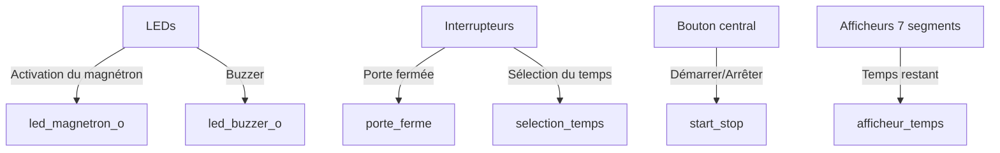
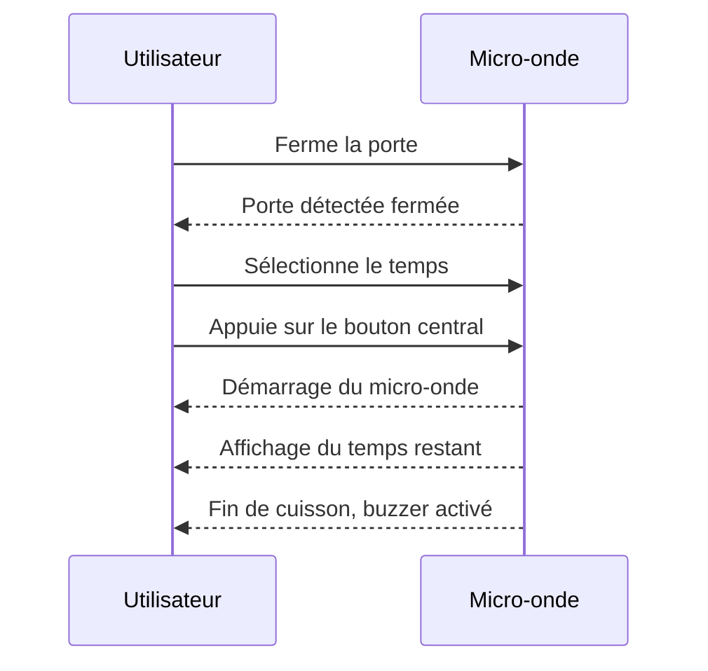
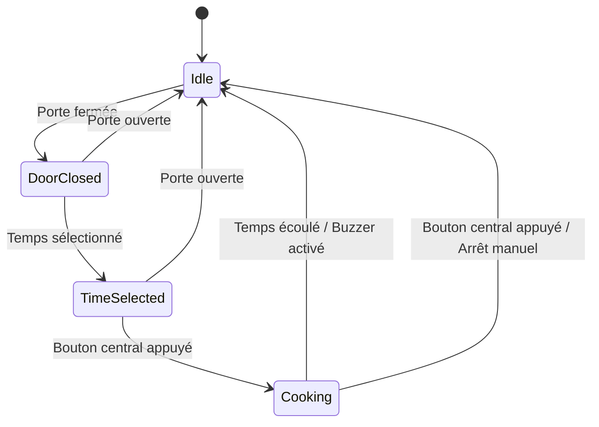

# Micro-ondes-VHDL

## Cahier des Charges

Ce projet consiste à réaliser le système contrôlant un micro-onde en VHDL sur une carte BASYS3. Les spécifications du système sont les suivantes :

### Composants

- **2 LEDs** : Simulent le buzzer et l’activation du magnétron.
- **1 Interrupteur** : Sert de capteur pour indiquer si la porte est fermée.
- **Des interrupteurs** : Permettent de sélectionner le temps de fonctionnement.
- **Le bouton central** : Utilisé pour lancer le système.
- **Les afficheurs 7 segments** : Affichent le temps restant.

### Fonctionnalités

1. **Activation du magnétron et du buzzer** :
    - Les LEDs simulent l'activation du magnétron et du buzzer.
    
2. **Capteur de porte** :
    - Un interrupteur sert de capteur pour détecter si la porte du micro-onde est fermée.
    
3. **Sélection du temps de fonctionnement** :
    - Des interrupteurs permettent de sélectionner le temps de fonctionnement du micro-onde.
    
4. **Lancement du système** :
    - Le bouton central est utilisé pour démarrer le micro-onde.
    
5. **Affichage du temps restant** :
    - Les afficheurs 7 segments montrent le temps restant de cuisson.

### Schéma de Connexion

### Diagramme de Fonctionnement

### Schéma de la Machine à État

### Images des Composants

## Conclusion

Ce projet permet de simuler le fonctionnement d'un micro-onde en utilisant VHDL sur une carte BASYS3. Les différentes fonctionnalités sont implémentées à l'aide de LEDs, interrupteurs, un bouton central et des afficheurs 7 segments pour offrir une expérience utilisateur complète.