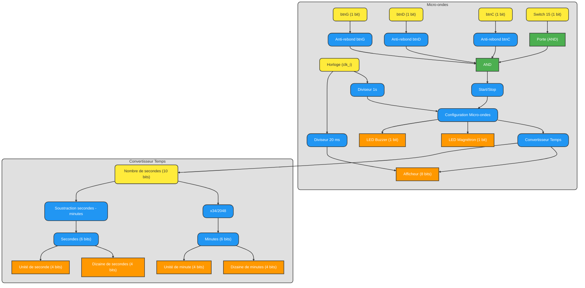
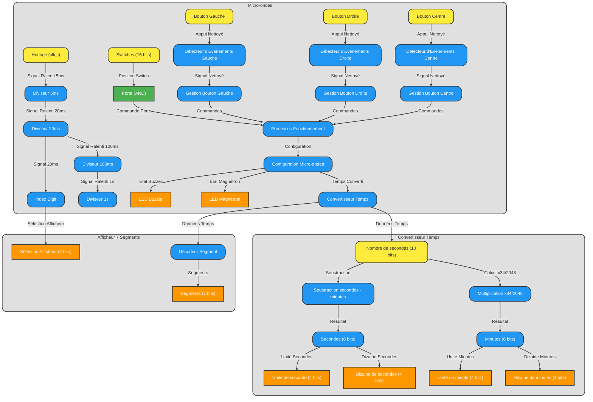
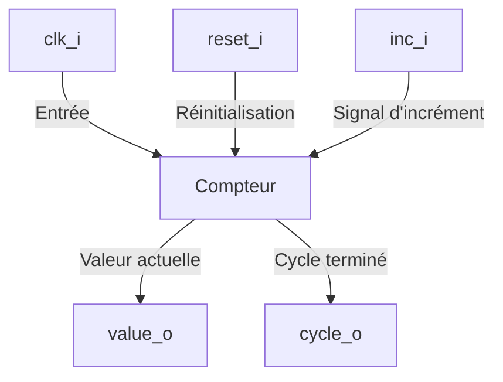
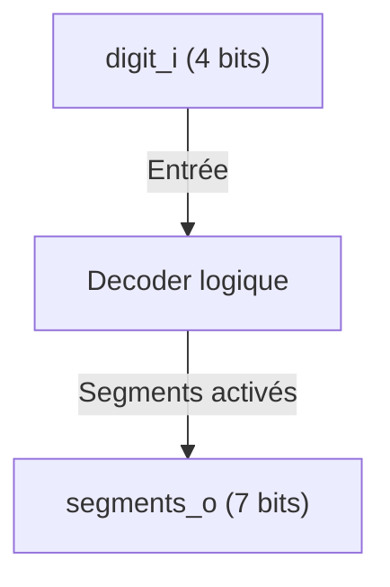
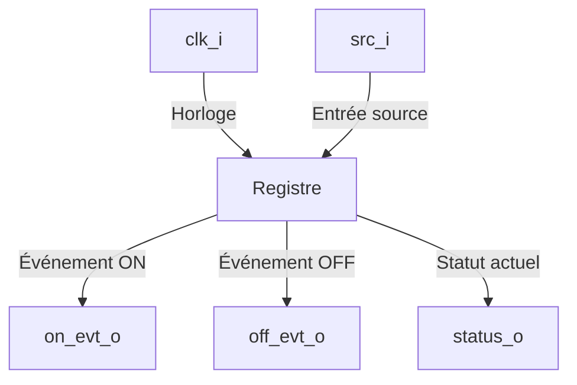

# Rapport Technique - Projet Micro-ondes en VHDL

## Table des matières

## 1\. Introduction

Les avancées technologiques dans le domaine de l'électronique numérique ont permis la conception de systèmes permettant la réalisation de tâches concurrentes. Les FPGA (Field Programmable Gate Arrays) sont ces systèmes. C'est sur cette plateforme que nous avons réalisé ce projet. Notre but était de concevoir l'équivalent d'un micro-ondes en faisant usage d'abstractions cohérentes pour remplacer les parties mécaniques de celui-ci par des indicateurs visuels adaptés. Ce projet avait pour visée de nous apprendre à implémenter un tel système en utilisant un langage de description (VHDL) tout en approfondissant nos connaissances en logique combinatoire séquentielle. Ce rapport détails les différentes étapes de développement du projet, de l'analyse du cahier des charges et du besoin a l'implémentation a proprement parler sur la carte Basys3.

 

### 1.1. Contexte du projet

 

\[Insérez ici une description du contexte et des objectifs pédagogiques du projet.\]

 

### 1.2. Objectifs

 

- Réaliser un visuel schématisant l'ensemble de notre systeme, ses ports, signaux et "blocs" internes.
- Implémenter le pilotage et l'affichage de valeur sur les afficheurs 7 segments.
- Implémenter le fonctionnement de notre schéma en VHDL en utilisant un processus par "bloc".
- Corriger les erreurs d'asynchronisme en regroupant les processus en un seul et sous la même liste de sensibilité.
- Polissage et révision de la logique du micro-ondes.

 

&lt;div class="page-break-before"&gt;&lt;/div&gt;

 

## 2\. Analyse et Conception

 

### 2.1. Schéma global du système

 

Ce schéma est celui que nous avions fait de prime abord, en début de projet :

 



 

Apres réflexion, nous y avons fait un certain nombre d'ajustements :

 



 

&lt;div class="page-break-before"&gt;&lt;/div&gt;

 

### 2.2. Décomposition fonctionnelle

 

Dans la réalisation de notre micro-ondes nous avons utilisé trois entités provenant des séances de TPs :

 

- **CounterModN :** Cette entité implémente un registre de bascules qui permettent de compter de 0 jusqu'a une valeur N-1.
- **SegmentDecoder :** Cette derniere entité est celle qui se charge de faire la conversion de valeur numériques aux valeurs binaires utilisables par les afficheurs sept segments.
- **EventDetector :** Quant a cette entité, nous l'avons rencontré lors du projet de classe StopWatch, elle joue le rôle d'anti-rebond, seul le front montant de l'appui sur un bouton est pris en compte, de telle sorte que nos incrément ne sont fait qu'une seule fois.

 

Ainsi que notre entité, représentant notre micro-ondes :

 

---

 

## 3\. Implémentation en VHDL

 

### 3.1. Modélisation des entités

 

- Schéma bloc de `CounterModN`

 



 

- Schéma bloc de `SegmentDecoder`

 



 

- Schéma bloc de `EventDetector`

 



 

### 3.2. Signaux internes

 

Description des principaux signaux :

 

- **Gestion des horloges :**

  - clk_slow_5ms, clk_slow_20ms, clk_slow_100ms, clk_slow_1s : Signaux générés par les diviseurs d’horloge (implémentations de CounterModN), permettant de ralentir la fréquence pour synchroniser certaines parties du système.

- **Gestion des boutons :**

  - btn_left_s, btn_right_s, btn_center_s : Signaux anti-rebonds générés par le module EventDetector.

  - **Utilité :**

    - btn_left_s : Diminuer le temps de fonctionnement.

    - btn_right_s : Augmenter le temps de fonctionnement.

    - btn_center_s : Démarrer ou arrêter le micro-ondes.

- **Contrôle des fonctionnalités :**

  - porte_fermee : État du capteur de porte fermée ('0' : ouverte, '1' : fermée).

  - fonctionnement : Indique si le micro-ondes est en marche.

  - pause : Active le mode pause lorsque le système est arrêté.

  - magnetron : Simule l’activation du magnétron ('0' : -, '1' : actif).

  - buzzer_actif : Simule l’activation du buzzer lorsque le temps est écoulé ('0' : -, '1' : actif).

- **Gestion du temps :**

  - secondes : Temps total restant (0 à 5999 secondes).

  - minute, seconde : Décomposent le temps restant en minutes et secondes.

  - dizaine_minute, unite_minute, dizaine_seconde, unite_seconde : Décomposent les unités pour l’affichage.

- **Multiplexage des afficheurs :**

  - digit_index : Indique quel afficheur (0 à 3) est activé sur l’afficheur.

  - valeur_afficheur : Valeur à afficher sur l'afficheur activé.

  - segments : Vecteur de 7 bits pour l’affichage.

 

### 3.3. Conception du schéma global

 

L’idée ici est d’avoir une idée globale du chemin que l’on va prendre avant de commencer à coder, cette étape est presque obligatoire afin de ne pas se perdre ni de se tromper durant le codage. Notre premier jet de schéma est le suivant :

 

IMAGE (schéma global)

 

- Le diviseur 1s permet de transformer la fréquence de la clock qui est beaucoup trop rapide pour notre micro-ondes en un signal égal à 1 chaque seconde.

- De même pour le diviseur 20 ms qui nous permettra d’afficher le temps.

- Anti-rebond permet au bouton d’avoir un fonctionnement normal et d’éviter que chaque bouton soit considéré comme appuyer plusieurs fois lors d’un appui simple.

- Le processus porte nous renvoie 1 lorsque la porte est bien fermée et 0 lorsqu’elle est ouverte.

- Start/stop permet de transformer le signal du bouton centrale permettant soit de démarrer le processus, soit de mettre en pause celui-ci.

- Configuration chrono permet à l’utilisateur de configurer le temps que le micro-ondes fonctionnera, celui-ci permet d’augmenter de 30 secondes le chronomètre lors d’un appui sur le bouton droit et de le diminuer lors d’un appui sur le bouton gauche. Nous avons bien pris en compte les valeurs maximales de celui-ci, l’utilisateur ne pourra pas diminuer le chronomètre lorsqu’il est inférieur à 30 secondes ou bien de l’augmenter lorsqu’il est supérieur à 99 minutes et 31 secondes c’est-à-dire 5971 secondes.

- Fonctionnement micro-ondes permet de gérer le temps de fonctionnement celui-ci. Il prend en entrée la porte « et » qui vérifie que tout est ok pour lancer le micro-ondes et configuration chrono afin de savoir pendant combien de temps il fonctionnera. Celui-ci décomptera le chronomètre jusqu’à atteindre 0 seconde et arrêter son fonctionnement.

- Convertisseur, comme le nom l’indique, permet de convertir le temps, que l’on a jusque-là considéré en secondes, en minutes et secondes afin de simplifier l’usage pour l’utilisateur.

 

Une fois le schéma terminé, nous devons commencer à réfléchir à ce qu’il faut faire à l’intérieur de chaque boîte. Le premier problème que nous avons rencontré est la gestion du temps au sein du code du micro-onde. Dans certains cas, il est beaucoup plus simple de le gérer en le comptant en secondes dès le début en faisant un diviseur 1sec avec la clock. Pour autant, arrivé à l’afficheur, il est beaucoup plus complexe d’utiliser des secondes. En effet pour celui on est censé transformer les secondes en afficheur, un pour les dizaines de minutes, un pour les minutes, un pour les dizaines de secondes et le dernier pour les secondes. Pour cela, il faudrait effectuer une division euclidienne des secondes pour récupérer un certain nombre de minutes et le reste serait le nombre de secondes, or la division euclidienne demande beaucoup de ressource à l’ordinateur et cela pourrait grandement faire ralentir le programme.

 

En réalité la division par une puissance de 2 ne pose pas de problème, nous allons donc utiliser cette méthode. Plutôt que de diviser par 60 dans notre cas, cela revient à multiplier par 1/60 (=0.017). Multiplions par 2048 (=34.133333…) Nous ne pouvons garder que des valeurs entières. Prenons donc 34. Nous allons donc faire nombre_secondes  *34 /2048. Dans le cas où le nombre de secondes est 120, nous devrions avoir le résultat de la division qui est égale à 2. Avec la nouvelle méthode, la valeur obtenue est de 1.9921875, cette valeur n’est pas exacte mais n’est que très légèrement différente. Nous allons donc utiliser cette méthode puisque la division par 2048 est possible dans notre cas. Sachant que nous allons devoir ensuite diviser par 10 pour obtenir les dizaines de minutes, minutes ainsi que les dizaines de secondes et secondes, nous allons utiliser la même méthode. 1/10 = 0.1 =&gt;* 2048 = 204,8 . Prenons 204 =&gt; 55 \*204/2048 = 5.478515625. L’erreur est ici aussi négligeable, nous aurons bien des dizaines de secondes égales à 5 et des secondes égales à 5 si nous prenons la valeur entière la plus proche. Voici un schéma pour expliquer le fonctionnement :

 

IMAGE (explication \*34/2048 truc chelou du temps là)

 

Nous stockerons par la suite ces 4 valeurs en 4 bits afin de pouvoir les utiliser pour l’afficheur.

 

Après de nombreux tests sur chronogramme et sur la carte basys-3 nous sommes venus à faire des changements dans le fonctionnement de notre micro-ondes.

 

Voici la version finale de notre code

 

### 3.4. Code finale de notre projet

 

La partie décodeur à été récupérer du TP chronomètre et nous permet d’affilié le chiffre du code à un chiffre visible par l’utilisateur lors de l’utilisation de son micro-ondes. Le code est le suivant : Dans notre cas il ne sera utile qu’entre les chiffres 0 à 9 puisque nous ne comptons pas compter en hexadécimal mais en décimal. La gestion des LED permettant de signaler à l’utilisateur le fonctionnement et la fin du fonctionnement se code ainsi :

 

Lors de l’utilisation du micro-ondes les leds sur chaque côtés sont en fonctionnement, lorsque celui s’arrête alors les leds centrales s’allument pendant quelques secondes .

 

Afin de pouvoir avoir des cycles de temps précis il nous fallaitr diviser le signal de la clock que l’on a. Cette division ce fait de la manière suivante pour plusieurs temps différents :

 

Ces différents diviseurs nous serviront tout au long de notre code comme par exemple lors de l’affichage du chronomètre sur la carte basys-3.

 

Chaque bloc de notre schéma sera codé à l’intérieur d’un seul et même process (p_fonctionnement_micro_ondes) dans lequel chaque bloc seront divisés les uns des autres.

 

La gestion de porte fermée permet de regarder si toutes les conditions sont bonnes au démarrage de notre micro-ondes. Dans le cas où le switch correspondant à la porte est activé alors il renvoie « 1 ». Dans le cas où celui-ci est alors il renvoie « 0 » et met le système en pause dans le cas où celui-ci est en route. Le process start/stop lance le processus de fonctionnement si il n’est pas déjà en route, dans le cas où il est en route il met alors le processus en pause. La vérification des conditions nécessaires pour le démarrage ne se fait pas ici mais à un autre endroit.

 

Configuration chrono permet à l’utilisateur de choisir le temps de fonctionnement qu’il souhaite. Dans le cas où le bouton droit est appuyé alors le temps est augmenté de 30 secondes, si le bouton droit est appuyé alors le temps diminue de 30 secondes. Nous avons bien évidemment pris les précautions que celui-ci ne puisse pas prendre de valeurs impossibles tel que des valeurs négatives ou des valeurs supérieures à 5999 secondes. Fonctionnement micro-ondes vient gérer la mise en route du micro-ondes. Dans le cas où fonctionnement est en route, le processus n’est pas en pause et que la porte est bien fermée, alors le micro-ondes démarre. Le magnétron est donc égal à 1 tant que le temps n’est pas tombé à 0 seconde, de plus ce processus vient enlever 1 à la variable secondes. Dans les autres cas le magnétron est égal à 0.

 

Le buzzer est là afin de prévenir l’utilisateur de la fin de fonctionnement du micro-ondes. Il regarde si le fonctionnement est toujours égal à 1 et si les secondes sont égales à 0. Dans ce cas il stoppe le fonctionnement et lance un compteur de 3 secondes qui est le temps où les LED du buzzer seront allumées. Le processus de conversion des secondes vient convertir le nombre de secondes totales en 4 variables différentes correspondant aux valeurs nécessaires à l’afficheur, c’est-à-dire les dizaines de minute, les unités de minute, les dizaines de seconde ainsi que les unités de seconde.

 

Le process principal est fini, d’autre process sont hors de celui-ci car ils ne dépendent pas de la même liste de sensibilité. Dans la théorie nous pourrions les mettre dans le même mais cela compromettrait la visibilité du code.

 

Dans ce process on vient gérer la cadence d’affichage, dans notre cas chaque afficheur 7 segments sera actualisé tous les 5x4 ms soit 20 ms. Nous avons préféré mettre ce temps afin de ne voir aucun scintillement au niveau des afficheurs et pour faire croire à l’œil humain que les LED sont allumées en continu. Le MUX pour afficheur vient quant à lui donner à l’afficheur la valeur qu’il doit afficher. Pour le premier segment ce sont les dizaines de minutes, le second les unités de minute etc…

 

Comme son nom l’indique, l’activation des afficheurs vient sélectionner les segments à afficher.

 

---

 

## 4\. Simulation et Tests

 

### 4.1. Méthodologie des tests

 

Explications sur les étapes suivies pour tester le système (simulation comportementale, chronogrammes, etc.).

 

### 4.2. Résultats obtenus

 

#### Chronogrammes

 

- Chronogramme de \[module A\] 

  

- Chronogramme de \[module B\] 

  

 

#### Tests sur FPGA

 

\[Insérez ici des explications sur les tests réalisés sur la carte BASYS3.\]

 

### 4.3. Analyse des performances et limites

 

Discussion des performances obtenues, des défis rencontrés et des améliorations possibles.

 

---

 

## 5\. Conclusion et Perspectives

 

### 5.1. Résumé des résultats obtenus

 

\[Rappel des points clés du projet.\]

 

### 5.2. Améliorations possibles

 

- \[Amélioration 1\]
- \[Amélioration 2\]

 

### 5.3. Compétences acquises

 

\[Liste des compétences techniques et personnelles développées.\]

 

---

 

## Annexes

 

### A. Code VHDL complet

 

```vhdl
-- ============================================================================

-- ============================================================================

-- ============================================================================

-- ============================================================================

-- Ce code fonctionne (sauf les animations de LEDs)

-- ============================================================================

-- ============================================================================

-- ============================================================================

-- ============================================================================

  
  

--*****************************************************************************

--

-- CounterModN entity+archi

--

--*****************************************************************************

library ieee;

use ieee.std_logic_1164.all;

  

entity CounterModN is

generic(

N : positive

);

port(

clk_i, reset_i, inc_i : in std_logic;

value_o : out integer range 0 to N - 1;

cycle_o : out std_logic

);

end CounterModN;

  

architecture Behavioral of CounterModN is

signal value_reg, value_next : integer range 0 to N - 1;

begin

p_value_reg : process(clk_i, reset_i)

begin

if reset_i = '1' then

value_reg <= 0;

elsif rising_edge(clk_i) then

if inc_i = '1' then

value_reg <= value_next;

end if;

end if;

end process p_value_reg;

  

value_next <= 0 when value_reg = N - 1 else value_reg + 1;

  

value_o <= value_reg;

cycle_o <= '1' when inc_i = '1' and value_reg = N - 1 else '0';

end Behavioral;

  
  

--*****************************************************************************

--

-- SegmentDecoder entity+archi

--

--*****************************************************************************

library ieee;

use ieee.std_logic_1164.all;

  

entity SegmentDecoder is

port(

digit_i : in natural range 0 to 15;

segments_o : out std_logic_vector(6 downto 0)

);

end SegmentDecoder;

  

architecture TruthTable of SegmentDecoder is

begin

with digit_i select

segments_o <= "1111110" when 0,

"0110000" when 1,

"1101101" when 2,

"1111001" when 3,

"0110011" when 4,

"1011011" when 5,

"1011111" when 6,

"1110000" when 7,

"1111111" when 8,

"1111011" when 9,

"1110111" when 10,

"0011111" when 11,

"1001110" when 12,

"0111101" when 13,

"1001111" when 14,

"1000111" when 15;

end TruthTable;

  

--*****************************************************************************

--

-- EventDetector entity+archi

--

--*****************************************************************************

library ieee;

use ieee.std_logic_1164.all;

  

entity EventDetector is

generic(

DURATION : positive := 1

);

port(

clk_i : in std_logic;

src_i : in std_logic;

on_evt_o : out std_logic;

off_evt_o : out std_logic;

status_o : out std_logic

);

end EventDetector;

  

architecture Simple of EventDetector is

-- Declarations

signal src_reg : std_logic_vector(0 to 1) := "00";

begin

  

-- processus de fonctionnement par binaire pur

fonctionnement : process(clk_i)

begin

if rising_edge(clk_i) then

src_reg(0) <= src_i;

src_reg(1) <= src_reg(0);

end if;

end process fonctionnement;

-- Concurrent statements

on_evt_o <= src_reg(0) and not src_reg(1);

off_evt_o <= src_reg(1) and not src_reg(0);

status_o <= src_reg(0);

end Simple;

  

--*****************************************************************************

--

-- Micro_ondes entity+archi

--

--*****************************************************************************

library ieee;

use ieee.std_logic_1164.all;

use ieee.numeric_std.all;

  

entity micro_ondes is

port(

-- Définition de nos ports :

clk_i : in std_logic;

switches_i : in std_logic_vector(15 downto 0);

btn_left_i : in std_logic;

btn_right_i : in std_logic;

btn_center_i : in std_logic;

btn_up_i : in std_logic;

btn_down_i : in std_logic;

  

leds_o : out std_logic_vector(15 downto 0);

  

disp_segments_n_o : out std_logic_vector(0 to 6);

disp_select_n_o : out std_logic_vector(3 downto 0)

);

end micro_ondes;

  

architecture Structural of micro_ondes is

  

-- Clock progressivement ralentie :

signal clk_slow_5ms, clk_slow_20ms, clk_slow_100ms, clk_slow_1s : std_logic;

  

-- Signaux internes :

signal porte_fermee : std_logic := '0';

signal fonctionnement : std_logic := '0';

signal pause : std_logic := '0';

signal magnetron : std_logic := '0';

signal buzzer_actif : std_logic := '0';

signal compteur_buzzer : integer range 0 to 3 := 0;

  

signal secondes : integer range 0 to 5999 := 0;

signal minute : integer range 0 to 99;

signal seconde : integer range 0 to 59;

  

signal dizaine_minute : integer range 0 to 9;

signal unite_minute : integer range 0 to 9;

signal dizaine_seconde : integer range 0 to 5;

signal unite_seconde : integer range 0 to 9;

  

signal digit_index : integer range 0 to 3;

signal valeur_afficheur : integer range 0 to 9;

signal segments : std_logic_vector(0 to 6); -- Segments pour l'affichage

signal btn_left_s : std_logic;

signal btn_right_s : std_logic;

signal btn_center_s : std_logic;

-- signal btn_up_s : std_logic;

-- signal btn_down_s : std_logic;

constant DURATION : integer := 2;

  
  

-- Signaux ajoutés par Kenneth :

  

begin

-------------------------------------------------------------------

-- Décalaration des instructions concurentes :

-------------------------------------------------------------------

-------------------------------------------------------------------

-- AFFECTATION LEDs --

-------------------------------------------------------------------

leds_o(14 downto 11) <= (others => magnetron);

leds_o(4 downto 0) <= (others => magnetron);

leds_o(10 downto 5) <= (others => buzzer_actif);

leds_o(15) <= switches_i(15);

  

-------------------------------------------------------------------

-- NÉGATION DES SEGMENTS --

-------------------------------------------------------------------

disp_segments_n_o <= not segments;

  

-------------------------------------------------------------------

-- Implémentation des diviseurs de clock :

-------------------------------------------------------------------

divider_5ms_inst : entity work.CounterModN(Behavioral)

generic map(

N => 500000

)

port map(

clk_i => clk_i,

reset_i => '0',

inc_i => '1',

value_o => open,

cycle_o => clk_slow_5ms

);

divider_20ms_inst : entity work.CounterModN(Behavioral)

generic map(

N => 4

)

port map(

clk_i => clk_i,

reset_i => '0',

inc_i => clk_slow_5ms,

value_o => open,

cycle_o => clk_slow_20ms

);

divider_100ms_inst : entity work.CounterModN(Behavioral)

generic map(

N => 5

)

port map(

clk_i => clk_i,

reset_i => '0',

inc_i => clk_slow_20ms,

value_o => open,

cycle_o => clk_slow_100ms

);

divider_1s_inst : entity work.CounterModN(Behavioral)

generic map(

N => 10

)

port map(

clk_i => clk_i,

reset_i => btn_center_i,

inc_i => clk_slow_100ms,

value_o => open,

cycle_o => clk_slow_1s

);

  

-------------------------------------------------------------------

-- Implémentation des anti-rebonds :

-------------------------------------------------------------------

btn_left_detec : entity work.EventDetector(Simple)

generic map(

DURATION => DURATION

)

port map(

clk_i => clk_i,

src_i => btn_left_i,

on_evt_o => btn_left_s,

off_evt_o => open,

status_o => open

);

btn_right_detec : entity work.EventDetector(Simple)

generic map(

DURATION => DURATION

)

port map(

clk_i => clk_i,

src_i => btn_right_i,

on_evt_o => btn_right_s,

off_evt_o => open,

status_o => open

);

btn_center_detec : entity work.EventDetector(Simple)

generic map(

DURATION => DURATION

)

port map(

clk_i => clk_i,

src_i => btn_center_i,

on_evt_o => btn_center_s,

off_evt_o => open,

status_o => open

);

  

-------------------------------------------------------------------

-- Process principal :

-------------------------------------------------------------------

p_fonctionnement_micro_ondes : process(clk_i)

begin

if rising_edge(clk_i) then

  

----------------------------------------------------------------

-- GESTION PORTE FERMÉE / PAUSE (switches_i(15)) --

----------------------------------------------------------------

if switches_i(15) = '0' then

porte_fermee <= '0';

pause <= '1';

else

porte_fermee <= '1';

end if;

  

----------------------------------------------------------------

-- BOUTON START/STOP (btn_center_i) --

----------------------------------------------------------------

if btn_center_s = '1' then

if fonctionnement = '1' then

-- Charlie, on pause tout ça !

fonctionnement <= '0';

pause <= '1';

else

-- Charlie, on remet tout en route !

fonctionnement <= '1';

pause <= '0';

end if;

end if;

  

----------------------------------------------------------------

-- CONFIGURATION CHRONO (btn_left_i, btn_right_i) --

----------------------------------------------------------------

if btn_left_s = '1' then

if secondes > 29 then

secondes <= secondes - 30; -- minimum atteignable de 0s

end if;

elsif btn_right_s = '1' then

if secondes < 5970 then

secondes <= secondes + 30; -- maximum atteignable de 99m59s

end if;

end if;

  

if clk_slow_1s = '1' then

----------------------------------------------------------------

-- FONCTIONNEMENT MICRO-ONDES --

----------------------------------------------------------------

if fonctionnement = '1' and pause = '0' and porte_fermee = '1' then

if secondes > 0 then

magnetron <= '1';

secondes <= secondes - 1;

else

magnetron <= '0';

end if;

else

magnetron <= '0';

end if;

  

----------------------------------------------------------------

-- BUZZER --

----------------------------------------------------------------

if fonctionnement = '1' and secondes = 0 then

buzzer_actif <= '1';

fonctionnement <='0';

elsif buzzer_actif = '1' and compteur_buzzer < 3 then

compteur_buzzer <= compteur_buzzer + 1;

else

buzzer_actif <='0';

compteur_buzzer <= 0;

end if;

end if;

  

----------------------------------------------------------------

-- CONVERSION SECONDES -> 4 QUARTETS -> AFFICHEUR --

----------------------------------------------------------------

minute <= secondes / 60;

seconde <= secondes - (minute * 60);

dizaine_seconde <= seconde / 10; --* 204 / 2048;

unite_seconde <= seconde - (dizaine_seconde * 10);

dizaine_minute <= minute / 10;

unite_minute <= minute - (dizaine_minute * 10);

  

end if;

end process p_fonctionnement_micro_ondes;

  

-------------------------------------------------------------------

-- CADENÇAGE CHOIX AFFICHEUR MUX --

-------------------------------------------------------------------

process(clk_i)

begin

if rising_edge(clk_slow_20ms) then

if digit_index = 3 then

digit_index <= 0;

else

digit_index <= digit_index + 1;

end if;

end if;

end process;

  

-------------------------------------------------------------------

-- MUX POUR AFFICHEUR --

-------------------------------------------------------------------

-- Sélection de la valeur à afficher :

with digit_index select

valeur_afficheur <= unite_seconde when 0,

dizaine_seconde when 1,

unite_minute when 2,

dizaine_minute when 3;

  

---------------------------------------------------------------------------

-- Activation des afficheurs (active bas)

process(digit_index)

begin

case digit_index is

when 0 => disp_select_n_o <= "1110";

when 1 => disp_select_n_o <= "1101";

when 2 => disp_select_n_o <= "1011";

when 3 => disp_select_n_o <= "0111";

  

when others => disp_select_n_o <= "1111"; -- Désactive tous les afficheurs

end case;

end process;

  
  

-------------------------------------------------------------------

-- Implémentation de l'afficheur 7 segments :

-------------------------------------------------------------------

decoder_inst : entity work.SegmentDecoder(TruthTable)

port map(

digit_i => valeur_afficheur,

segments_o => segments

);

  

end Structural;
```

 

### B. Schémas détaillés

 

\[Schéma global et schémas des entités.\]

 

### C. Chronogrammes obtenus

 

\[Chronogrammes détaillés avec explications.\]

 

---

 