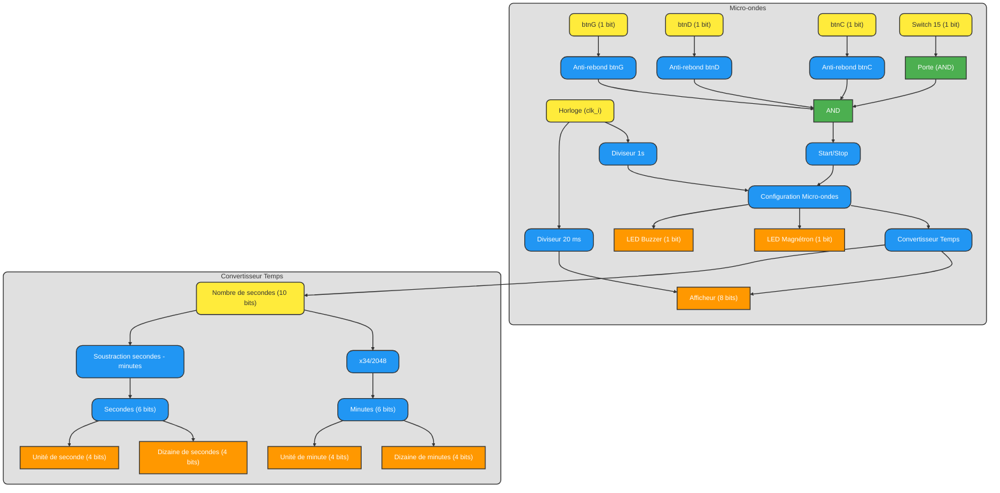
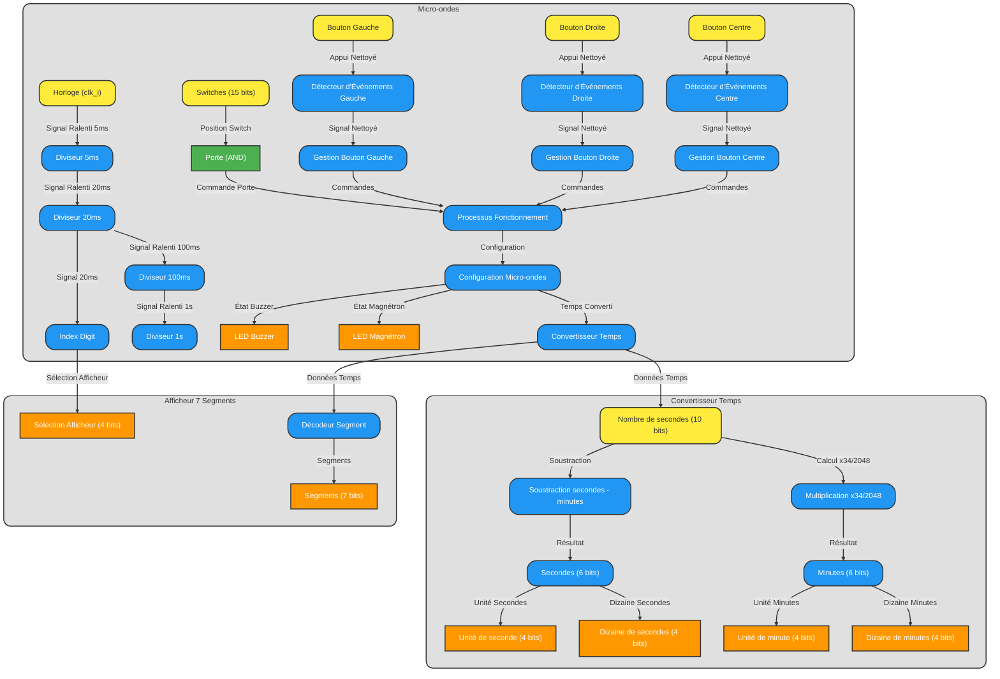
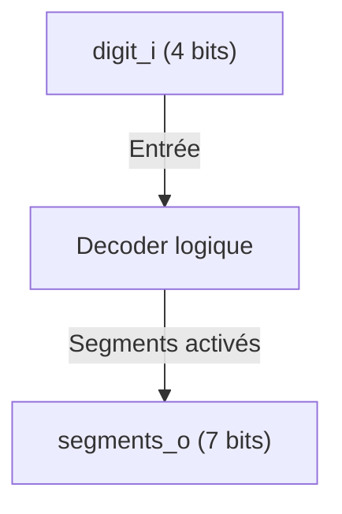
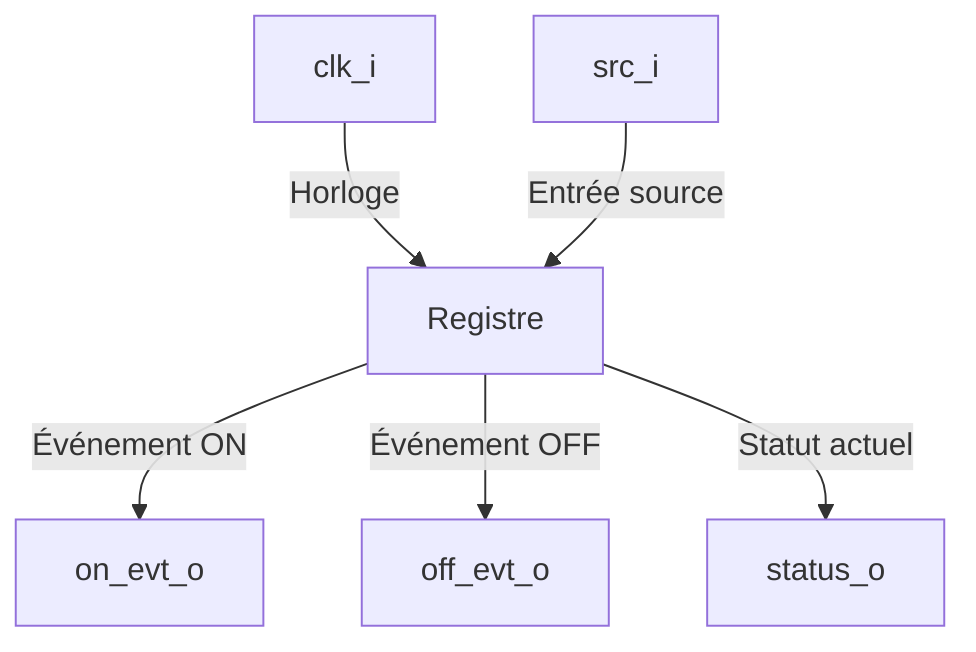

# Rapport Technique - Projet Micro-ondes en VHDL

## Table des matières

- [1. Introduction](#1-introduction)
  - [1.1. Contexte du projet](#11-contexte-du-projet)
  - [1.2. Objectifs](#12-objectifs)
- [2. Analyse et Conception](#2-analyse-et-conception)
  - [2.1. Notre cahier des charges](#21-notre-cahier-des-charges)
  - [2.2. Conception du schéma global](#22-conception-du-schéma-global)
  - [2.3. Réflexions sur la gestion du temps](#23-réflexions-sur-la-gestion-du-temps)
  - [2.4. Tests et ajustements](#24-tests-et-ajustements)
  - [2.5. Fonctionnalités spécifiques](#25-fonctionnalités-spécifiques)
- [3. Implémentation en VHDL](#3-implémentation-en-vhdl)
  - [3.1. Décomposition fonctionnelle](#31-décomposition-fonctionnelle)
  - [3.2. Signaux internes](#32-signaux-internes)
  - [3.3. Blocs de code principaux](#33-blocs-de-code-principaux)
    - [3.3.1. Décodeur (SegmentDecoder)](#331-décodeur-segmentdecoder)
    - [3.3.2. Gestion des LEDs](#332-gestion-des-leds)
    - [3.3.3. Diviseurs d’horloge](#333-diviseurs-dhorloge)
    - [3.3.4. Processus principal : p_fonctionnement_micro_ondes](#334-processus-principal--p_fonctionnement_micro_ondes)
    - [3.3.5. Cadence et multiplexage de l’afficheur](#335-cadence-et-multiplexage-de-lafficheur)
- [4. Simulation et Tests](#4-simulation-et-tests)
  - [4.1. Résultats obtenus](#41-résultats-obtenus)
    - [Chronogramme](#chronogramme)
    - [Tests sur FPGA](#tests-sur-fpga)
  - [4.2. Analyse des performances et limites](#42-analyse-des-performances-et-limites)
- [5. Conclusion et Perspectives](#5-conclusion-et-perspectives)
  - [5.1. Résumé des résultats obtenus](#51-résumé-des-résultats-obtenus)
  - [5.2. Améliorations possibles](#52-améliorations-possibles)
  - [5.3. Compétences acquises](#53-compétences-acquises)

---

## 1. Introduction
Les avancées technologiques dans le domaine de l'électronique numérique ont permis la conception de systèmes permettant la réalisation de tâches concurrentes. Les FPGA (Field Programmable Gate Arrays) sont ces systèmes. C'est sur cette plateforme que nous avons réalisé ce projet. Notre but était de concevoir l'équivalent d'un micro-ondes en faisant usage d'abstractions cohérentes pour remplacer les parties mécaniques de celui-ci par des indicateurs visuels adaptés.
Ce projet avait pour visée de nous apprendre à implémenter un tel système en utilisant un langage de description (VHDL) tout en approfondissant nos connaissances en logique combinatoire séquentielle.
Ce rapport détails les différentes étapes de développement du projet, de l'analyse du cahier des charges et du besoin a l'implémentation a proprement parler sur la carte Basys3.

### 1.1. Contexte du projet
[Insérez ici une description du contexte et des objectifs pédagogiques du projet.]

### 1.2. Objectifs
- [x] Réaliser un visuel schématisant l'ensemble de notre systeme, ses ports, signaux et "blocs" internes.
- [x] Implémenter le pilotage et l'affichage de valeur sur les afficheurs 7 segments.
- [x] Implémenter le fonctionnement de notre schéma en VHDL en utilisant un processus par "bloc".
- [x] Corriger les erreurs d'asynchronisme en regroupant les processus en un seul et sous la même liste de sensibilité.
- [x] Polissage et révision de la logique du micro-ondes.
- [ ] Réaliser l'animation des LEDs lors de l'activation du magnétron et lors de l'activation du buzzer.

---

## 2. Analyse et Conception
### 2.1. Notre cahier des charges
- Un afficheur à LEDs nous permet de voir le temps de fonctionnement voulu ainsi que le décompte une fois le micro-ondes lancé.
- Trois boutons permettent d’augmenter et de diminuer le temps de fonctionnement du micro-ondes ainsi que de le démarrer ou de l’arrêter.
- Un switch permet de simuler l'état de la porte (ouverte ou fermée) afin de stopper le processus dans le cas où celle-ci est ouverte, et d’empêcher le lancement du micro-ondes dans ce même cas.
- Des LEDs indiquent à l’utilisateur lorsque le micro-ondes est en fonctionnement et d'autres simulant le buzzer de fin de fonctionnement.

### 2.2. Conception du schéma global
L’idée ici est d’avoir une vision globale du chemin que nous allons prendre avant de commencer à coder. Cette étape est presque obligatoire pour éviter de se perdre ou de commettre des erreurs durant le développement.

Notre premier jet de schéma est le suivant : 



- Le diviseur 1s transforme la fréquence de la clock, beaucoup trop rapide pour notre micro-ondes, en un signal égal à 1 chaque seconde.
- De même, le diviseur 20 ms permet d’afficher le temps.
- L’anti-rebond assure un fonctionnement normal des boutons, en évitant que chaque appui soit interprété comme plusieurs appuis.
- Le processus porte renvoie 1 lorsque la porte est bien fermée, et 0 lorsqu’elle est ouverte.
- Start/stop permet de transformer l’état de démarrage ou d’arrêt.
- Configuration chrono permet à l’utilisateur de configurer le temps de fonctionnement du micro-ondes. Cela augmente de 30 secondes le chronomètre lors d’un appui sur le bouton droit, et le diminue lors d’un appui sur le bouton gauche. Nous avons pris en compte les valeurs limites : l’utilisateur ne pourra pas descendre en dessous de 30 secondes, ni dépasser 99 minutes et 59 secondes (soit 5999 secondes).
- Fonctionnement micro-ondes gère le temps de fonctionnement. Il prend en entrée l’état de la porte pour vérifier que tout est prêt pour lancer le micro-ondes, ainsi que la configuration chrono pour déterminer la durée de fonctionnement. Ce module décompte le chronomètre jusqu’à atteindre 0 et arrête alors le fonctionnement.
- Le convertisseur transforme le temps, initialement en secondes, en minutes et secondes pour simplifier l’usage pour l’utilisateur.

### 2.3. Réflexions sur la gestion du temps
Une fois le schéma terminé, nous avons réfléchi à ce qu’il fallait coder dans chaque module.

Le premier problème rencontré concernait la gestion du temps. Dans certains cas, il est plus simple de compter directement en secondes en utilisant un diviseur 1s. Cependant, à l’afficheur, il est plus complexe d’utiliser directement les secondes, car il faut transformer celles-ci en dizaines et unités de minutes et de secondes. Une division euclidienne serait nécessaire, mais elle demande beaucoup de ressources et pourrait ralentir le programme.

Nous avons utilisé une méthode alternative basée sur la division par une puissance de 2. Par exemple, au lieu de diviser par 60, nous multiplions par 1/60 (≈0.017) puis par 2048 (≈34.133). En arrondissant à 34, la formule devient :
nombre_secondes * 34 / 2048.
L’erreur introduite est minime. Cette approche est également utilisée pour diviser par 10 en utilisant :
nombre * 204 / 2048.

### 2.4. Tests et ajustements
Après de nombreux tests sur chronogrammes et sur la carte Basys-3, nous avons ajusté le fonctionnement de notre micro-ondes : 



- Décodeur : Récupéré du TP chronomètre, il associe un chiffre du code à un chiffre visible par l’utilisateur. Nous ne traitons que les chiffres de 0 à 9, car nous restons en décimal.
- LEDs : Pendant le fonctionnement, les LEDs latérales s’allument, et lorsqu’il s’arrête, les LEDs centrales s’allument pendant quelques secondes.
- Diviseurs : Différents diviseurs sont utilisés tout au long du code, par exemple pour l’affichage du chronomètre.
- Processus principaux : Chaque module est codé dans des processus distincts pour améliorer la clarté et l’organisation du code.

### 2.5. Fonctionnalités spécifiques
- Gestion de la porte fermée : Si le switch correspondant est activé, il renvoie 1 ; sinon, il renvoie 0 et met le système en pause.
- Start/stop : Ce processus démarre ou met en pause le fonctionnement du micro-ondes.
- Configuration chrono : Permet d’ajuster le temps de fonctionnement, tout en limitant les valeurs entre 30 et 5999 secondes.
- Fonctionnement micro-ondes : Démarre le micro-ondes si toutes les conditions sont remplies (porte fermée, etc.), puis décompte le temps restant jusqu’à 0.
- Buzzer : Indique la fin du fonctionnement avec un signal de 3 secondes.
- Conversion des secondes : Transforme le temps total en dizaines et unités de minutes et de secondes pour l’affichage.
- MUX pour afficheur : Gère l’affichage des segments 7 segments (dizaines et unités).
- Activation des afficheurs : Sélectionne le segment à afficher.

---

## 3. Implémentation en VHDL
### 3.1. Décomposition fonctionnelle

Dans la réalisation de notre micro-ondes nous avons utilisé trois entités provenant des séances de TPs :
- **CounterModN :** Cette entité implémente un registre de bascules qui permettent de compter de 0 jusqu'a une valeur N-1.

    ```mermaid
    graph TD
        A[clk_i] -->|Entrée| B[Compteur]
        C[reset_i] -->|Réinitialisation| B
        D[inc_i] -->|Signal d'incrément| B
        B -->|Valeur actuelle| E[value_o]
        B -->|Cycle terminé| F[cycle_o]
    ```

- **SegmentDecoder :** Cette derniere entité est celle qui se charge de faire la conversion de valeur numériques aux valeurs binaires utilisables par les afficheurs sept segments.



- **EventDetector :** Quant a cette entité, nous l'avons rencontré lors du projet de classe StopWatch, elle joue le rôle d'anti-rebond, seul le front montant de l'appui sur un bouton est pris en compte, de telle sorte que nos incrément ne sont fait qu'une seule fois.



Ainsi que notre entité, représentant notre micro-ondes :

- **micro-ondes :**

    ```mermaid
    graph TD
        clk_i -->|Horloge| Micro-ondes
        switches_i -->|Porte| Micro-ondes
        btn_left_i -->|Décrémenter| Micro-ondes
        btn_right_i -->|Incrémenter| Micro-ondes
        btn_center_i -->|Start / stop| Micro-ondes

        Micro-ondes -->|Magnétron / Buzzer| leds_o
        Micro-ondes -->|Digit| disp_segments_n_o
        Micro-ondes -->|Sélection afficheur| disp_select_n_o
    ```

### 3.2. Signaux internes
Description des principaux signaux :

- **Gestion des horloges :**
    - clk_slow_5ms, clk_slow_20ms, clk_slow_100ms, clk_slow_1s : Signaux générés par les diviseurs d’horloge (implémentations de CounterModN), permettant de ralentir la fréquence pour synchroniser certaines parties du système.


- **Gestion des boutons :**
    - btn_left_s, btn_right_s, btn_center_s : Signaux anti-rebonds générés par le module EventDetector.
    - **Utilité :**
        - btn_left_s : Diminuer le temps de fonctionnement.
        - btn_right_s : Augmenter le temps de fonctionnement.
        - btn_center_s : Démarrer ou arrêter le micro-ondes.


- **Contrôle des fonctionnalités :**
    - porte_fermee : État du capteur de porte fermée ('0' : ouverte, '1' : fermée).
    - fonctionnement : Indique si le micro-ondes est en marche.
    - pause : Active le mode pause lorsque le système est arrêté.
    - magnetron : Simule l’activation du magnétron ('0' : -, '1' : actif).
    - buzzer_actif : Simule l’activation du buzzer lorsque le temps est écoulé ('0' : -, '1' : actif).


- **Gestion du temps :**
    - secondes : Temps total restant (0 à 5999 secondes).
    - minute, seconde : Décomposent le temps restant en minutes et secondes.
    - dizaine_minute, unite_minute, dizaine_seconde, unite_seconde : Décomposent les unités et les dizaines pour l’affichage.


- **Multiplexage des afficheurs :**
    - digit_index : Indique quel afficheur (0 à 3) est activé sur l’afficheur.
    - valeur_afficheur : Valeur à afficher sur l'afficheur activé.
    - segments : Vecteur de 7 bits pour l’affichage.

### 3.3. Blocs de code principaux

#### 3.3.1. Décodeur (SegmentDecoder)

La partie décodeur a été récupérée du TP chronomètre et permet d’affilier un chiffre codé en binaire à un affichage visible par l’utilisateur sur l’afficheur 7 segments du micro-ondes. Dans notre cas, seuls les chiffres de 0 à 9 seront utilisés, car nous comptons en décimal et non en hexadécimal. Le code est le suivant :

```vhdl
architecture TruthTable of SegmentDecoder is
begin
    with digit_i select
        segments_o <= "1111110" when  0,
                      "0110000" when  1,
                      "1101101" when  2,
                      "1111001" when  3,
                      "0110011" when  4,
                      "1011011" when  5,
                      "1011111" when  6,
                      "1110000" when  7,
                      "1111111" when  8,
                      "1111011" when  9,
                      "1110111" when 10,
                      "0011111" when 11,
                      "1001110" when 12,
                      "0111101" when 13,
                      "1001111" when 14,
                      "1000111" when 15;
end TruthTable;
```

#### 3.3.2. Gestion des LEDs

Les LEDs indiquent à l’utilisateur l’état du micro-ondes :
	•	Lorsqu’il fonctionne, les LEDs sur les côtés s’allument.
	•	Lorsqu’il s’arrête, les LEDs centrales s’allument pendant quelques secondes. Voici le code correspondant :

```vhdl
-------------------------------------------------------------------
--                       AFFECTATION LEDs                        --
-------------------------------------------------------------------
    leds_o(14 downto 11)    <= (others => magnetron);
    leds_o(4 downto 0)      <= (others => magnetron);
    leds_o(10 downto 5)     <= (others => buzzer_actif);
    leds_o(15)              <= switches_i(15);

```

#### 3.3.3. Diviseurs d’horloge

Pour obtenir des cycles de temps précis, il est nécessaire de diviser le signal d’horloge principal. Les diviseurs d’horloge sont définis pour différentes périodes (5 ms, 20 ms, 100 ms et 1 s) et se codent comme suit :

```vhdl
-------------------------------------------------------------------
-- Implémentation des diviseurs de clock :
-------------------------------------------------------------------
divider_5ms_inst : entity work.CounterModN(Behavioral)
   generic map(
        N => 500000
    )
    port map(
        clk_i       => clk_i,
        reset_i     => '0',
        inc_i       => '1',
        value_o     => open,
        cycle_o     => clk_slow_5ms
    );
divider_20ms_inst : entity work.CounterModN(Behavioral)
   generic map(
        N => 4
    )
    port map(
        clk_i       => clk_i,
        reset_i     => '0',
        inc_i       => clk_slow_5ms,
        value_o     => open,
        cycle_o     => clk_slow_20ms
    );
divider_100ms_inst : entity work.CounterModN(Behavioral)
   generic map(
        N => 5
    )
    port map(
        clk_i       => clk_i,
        reset_i     => '0',
        inc_i       => clk_slow_20ms,
        value_o     => open,
        cycle_o     => clk_slow_100ms
    );
 divider_1s_inst : entity work.CounterModN(Behavioral)
   generic map(
        N => 10
    )
    port map(
        clk_i       => clk_i,
        reset_i     => btn_center_i,
        inc_i       => clk_slow_100ms,
        value_o     => open,
        cycle_o     => clk_slow_1s
    );
```

Ces diviseurs seront utilisés dans tout le code, notamment pour cadencer le chronomètre et l’affichage.

#### 3.3.4. Processus principal : p_fonctionnement_micro_ondes

Le cœur du système est géré par le processus p_fonctionnement_micro_ondes. Ce processus regroupe plusieurs blocs de gestion.
- Gestion de la porte fermée :
Ce bloc vérifie si les conditions sont réunies pour démarrer le micro-ondes. Si le switch de la porte est activé, il renvoie 1, sinon il met le système en pause :

```vhdl
if switches_i(15) = '0' then
    porte_fermee <= '0';
    pause <= '1';
else
    porte_fermee <= '1';
end if;
```

- Start/Stop :
Ce bloc gère le démarrage et l’arrêt du micro-ondes. Si le système est déjà en route, il le met en pause :

```vhdl
if btn_center_s = '1' then
    if fonctionnement = '1' then
        fonctionnement <= '0';
        pause <= '1';
    else
        fonctionnement <= '1';
        pause <= '0';
    end if;
end if;
```

- Configuration du chrono :
L’utilisateur peut ajuster le temps de fonctionnement avec les boutons gauche et droit. Le temps est limité entre 0 et 5999 secondes :

```vhdl
if btn_left_s = '1' then
    if secondes > 29 then
        secondes <= secondes - 30;
    end if;
elsif btn_right_s = '1' then
    if secondes < 5970 then
        secondes <= secondes + 30;
    end if;
end if;
```

- Fonctionnement du micro-ondes :
Le magnétron s’active si toutes les conditions sont réunies (fonctionnement en route, porte fermée, temps > 0) :

```vhdl
if fonctionnement = '1' and pause = '0' and porte_fermee = '1' then
    if secondes > 0 then
        magnetron <= '1';
        secondes <= secondes - 1;
    else
        magnetron <= '0';
    end if;
else
    magnetron <= '0';
end if;
```

- Buzzer :
Le buzzer avertit l’utilisateur lorsque le temps est écoulé et s’active pendant 3 secondes :

```vhdl
if fonctionnement = '1' and secondes = 0 then
    buzzer_actif <= '1';
    fonctionnement <= '0';
elsif buzzer_actif = '1' and compteur_buzzer < 3 then
    compteur_buzzer <= compteur_buzzer + 1;
else
    buzzer_actif <= '0';
    compteur_buzzer <= 0;
end if;
```

- Conversion des secondes :
Ce bloc décompose le temps total en dizaines et unités pour les minutes et les secondes, afin d’alimenter l’afficheur :

```vhdl
minute          <= secondes / 60;
seconde         <= secondes - (minute * 60);

dizaine_seconde <= seconde / 10; --* 204 / 2048;
unite_seconde   <= seconde - (dizaine_seconde * 10);

dizaine_minute  <= minute / 10;
unite_minute    <= minute - (dizaine_minute * 10);
```

#### 3.3.5. Cadence et multiplexage de l’afficheur
- Cadence d’affichage :
Chaque afficheur 7 segments est actualisé toutes les 5 ms pour éviter tout scintillement :

```vhdl
process(clk_slow_5ms)
begin
    if rising_edge(clk_slow_5ms) then
        if digit_index = 3 then
            digit_index <= 0;
        else
            digit_index <= digit_index + 1;
        end if;
    end if;
end process;
```

- MUX pour l’afficheur :
Ce bloc sélectionne la valeur à afficher pour chaque segment :

```vhdl
with digit_index select
    valeur_afficheur <= unite_seconde   when 0,
                        dizaine_seconde when 1,
                        unite_minute    when 2,
                        dizaine_minute  when 3;
```

- Activation des afficheurs :
Ce bloc active l'afficheur correspondant parmi les 4 disponibles :

```vhdl
process(digit_index)
begin
    case digit_index is
        when 0 => disp_select_n_o <= "1110"; 
        when 1 => disp_select_n_o <= "1101";
        when 2 => disp_select_n_o <= "1011";
        when 3 => disp_select_n_o <= "0111";

        when others => disp_select_n_o <= "1111"; -- Désactive tous les afficheurs
    end case;
end process;
```


---

## 4. Simulation et Tests
### 4.1. Résultats obtenus
#### Chronogramme


#### Tests sur FPGA
Les tests réalisés sur la carte BASYS3 ont confirmé le bon fonctionnement du système. Chaque composant a réagi exactement comme prévu :
	•	Les LEDs latérales et centrales se comportent parfaitement.
	•	L’afficheur 7 segments affiche les chiffres de manière fluide, sans scintillement.
	•	Les boutons répondent sans décalage mais avec un léger rebond aléatoire.
	•	Les diviseurs d’horloge fonctionnent correctement.

Ces tests sur le FPGA n’ont révélé aucune anomalie visuelle ou logique. Chaque fonctionnalité a pu être validée en conditions réelles.

### 4.2. Analyse des performances et limites
Sur le plan des performances, le système remplit tous les objectifs du cahier des charges.

Mais, certaines améliorations pourraient être envisagées :
- Optimisation de la fréquence d’horloge : on pourrait réduire encore plus la consommation de ressources du FPGA.
- Tests de robustesse : Bien que le système soit fonctionnel, des tests sur des cycles plus longs pourraient confirmer sa stabilité.

---

## 5. Conclusion et Perspectives
### 5.1. Résumé des résultats obtenus
Ce projet a été une belle occasion de mettre en pratique les concepts fondamentaux de l’électronique numérique, avec une application concrète : la conception d’un système simulant un micro-ondes. La gestion des horloges, avec les diviseurs permettant de synchroniser les différentes parties du système, a été l'axe principal du projet. Chaque module, que ce soit le compteur modulo-N, le décodeur 7 segments ou encore le détecteur d’événements, a été soigneusement intégré à l’architecture globale.
L'un des points les plus complexe du projet était la gestion des interactions entre les signaux internes via les différents processus que nous avions au départ, comme la détection de la porte fermée ou encore le contrôle des boutons. Ces détails ont permis d’assurer un fonctionnement fluide et fiable, tout en respectant les contraintes imposées par le cahier des charges.
Enfin, les phases de simulation et de tests ont été décisives pour valider le bon fonctionnement du système, aussi bien au niveau comportemental que sur la carte FPGA. Voir le système fonctionner réellement, avec les LEDs, les boutons et les afficheurs réagissant comme prévu, (quel soulagement) nous a apporté un grand sentiment de satisfaction.

### 5.2. Améliorations possibles
> [!NOTE]
> - Lors de la présentation du projet au professeur responsable de l'évalutation, nous avons remarqué que après un cycle de "cuissons" et après la désactivation du buzzer, un simple appui sur le boutton central relance le buzzer. Il faut donc revoir la gestion des conditions qui régissent le fonctionnement du buzzer.
> - Toujours lors de la même présentation nous avons compris que nous avions commis une erreur dans notre compréhension de l'anti-rebond. Dans notre esprit il suffisait de réagir sur le front d'un évennement boutton plutôt que sur son état pour mettre en place un anti-rebond. Il nous faut donc implémenter un vrai anti-rebond en se servant de l'instanciation de l'EventDetector.
> - Lors du fonctionnement de notre micro-ondes nous utilisons le bargraphe de LEDs de la Basys3 comme témoins lumineux lors du fonctionnement. Ce n'est qu'un artifice mais nous avons manqué à l'un des objectifs que nous nous étions fixés, qui consistait à animer ces témoins.

### 5.3. Compétences acquises
Ce projet nous aura permis de consolider nos bases en conception numérique en nous offrant une application pratique des systèmes combinatoires et séquentiels. Nous avons acquis une meilleure compréhension des horloges et des diviseurs de fréquence, ainsi que la gestion des transitions d’état et des signaux logiques. Les modélisation, simulation, et tests des différents modules a renforcé considérablement notre capacité à produire des descriptions implémentables sur FPGA via le langage VHDL. Bien que dans la réalité des faits ça ne semble pas encore être une science exacte nous avons progressé.
